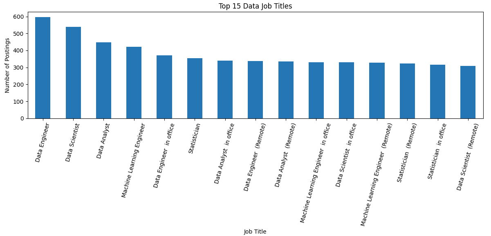
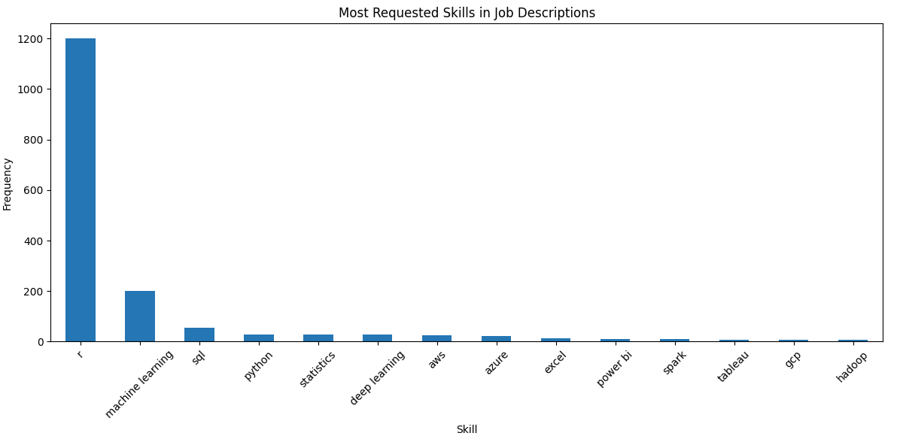
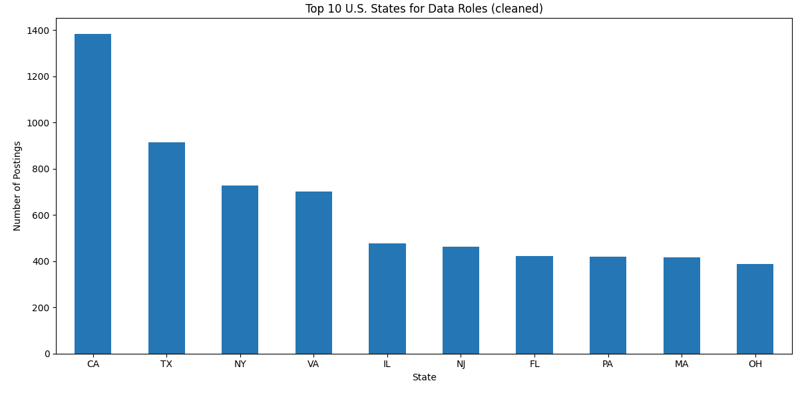

# 📊 Job Market Trends in Tech (U.S. Data Roles)

## 🔎 Project Overview
This project analyzes multiple publicly available job listing datasets (from Kaggle and other sources) to uncover insights about the **U.S. data job market**.  
The goal: answer key stakeholder questions that help job seekers and businesses understand where the demand is, which skills are most valuable, and how hiring trends vary by location.  

---

## 🚀 Stakeholder Questions
1. **What are the most in-demand data roles in the U.S.?**  
2. **What skills are most requested per role?**  
3. **How do job openings vary by location?**  

---

## 📂 Data Sources
Datasets were sourced from [Kaggle](https://www.kaggle.com/) (all publicly available):  
- [Data Science Job Postings (Indeed USA)](https://www.kaggle.com/datasets/yusufolonade/data-science-job-postings-indeed-usa)  
- [700+ AI & Data Science Roles (2025)](https://www.kaggle.com/datasets/princekhunt19/700-jobs-data-of-ai-and-data-fields-2025)  
- [Data Science Job Postings & Skills (2024)](https://www.kaggle.com/datasets/asaniczka/data-science-job-postings-and-skills)  
- [Jobs in Data (130K job descriptions, 2023)](https://www.kaggle.com/datasets/narsil/jobs-in-data-com)  
- [Comprehensive Data Science Job Listings](https://www.kaggle.com/datasets/brsahan/data-science-job)

⚠️ Note: I did **not upload raw data** into this repo, since these datasets are already public on Kaggle. Instead, I provide links and my cleaned dataset with only essential fields.

---

## 🛠️ Tools & Skills
- **Python** (Pandas, NumPy, Matplotlib, Regex)  
- **Google Colab** for cloud-based analysis  
- **Data cleaning & deduplication**  
- **Text mining** (keyword frequency for skills)  
- **Geospatial analysis & visualization** (state-level job distribution)  

---

## 🧹 Data Cleaning
Steps I performed:  
- Loaded 5 separate datasets and standardized column names  
- Coalesced different title/role/description/location fields into unified columns  
- Dropped duplicates and rows with missing job titles  
- Normalized text (lowercase, stripped whitespace)  
- Replaced missing values with `"unknown"` or `"not provided"`  
- Rolled up noisy location data to U.S. **state-level** for clearer trends  

---

## 📊 Key Insights
1️⃣ **Most In-Demand Roles:** Top roles include **Data Engineer, Data Scientist, Data Analyst**  
2️⃣ **Most Requested Skills:** Leading skills are **r, Machine Learning, SQL, Python**  
3️⃣ **Job Openings by Location:** Major hiring hubs are **California, Texas, New York, Virginia**  

*(Note: ~43% of postings didn’t specify a location, so results are based on valid U.S. postings only.)*  

---

## 📊 Visuals

  
*Top 15 most in-demand job titles*  

  
*Most requested skills across job descriptions*  

  
*Top U.S. states hiring for data roles (excluding unknown/remote)*  

---

## 🔮 Next Steps
- Expand NLP to extract **emerging skills** beyond simple keyword matching  
- Build a **time-series view** of job demand trends by month  
- Compare U.S. job trends with international datasets  

---

## 📢 Conclusion
This project strengthened my skills in:  
- Data cleaning at scale  
- Text mining for skill extraction  
- Geospatial analysis  
- Communicating insights to stakeholders  

---

## 💡 How to Run
1. Upload CSVs into Google Colab.  
2. Run the notebook cells (Python 3, Pandas, Matplotlib).  
3. Visualizations and cleaned data will be generated inline.  

---
